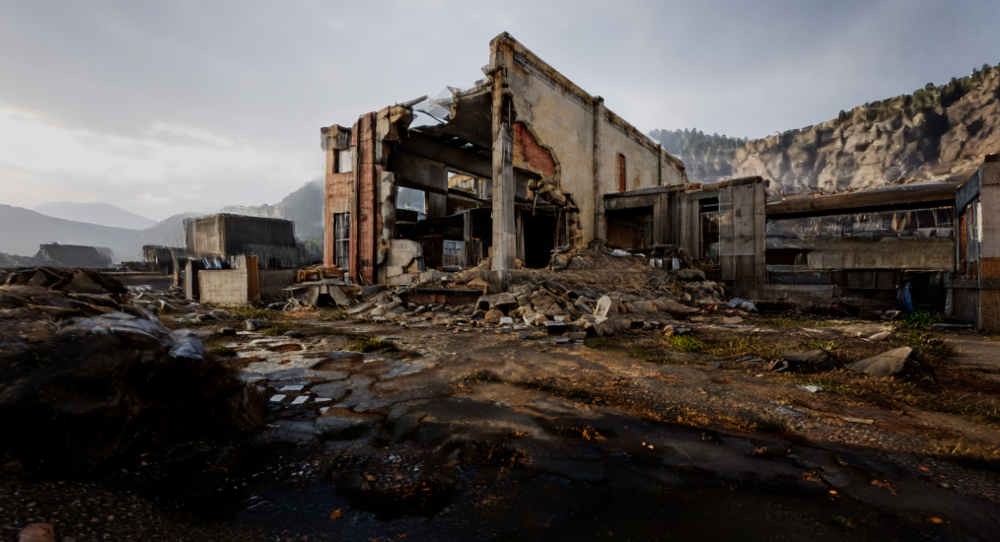
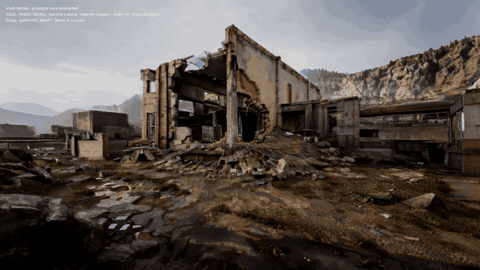
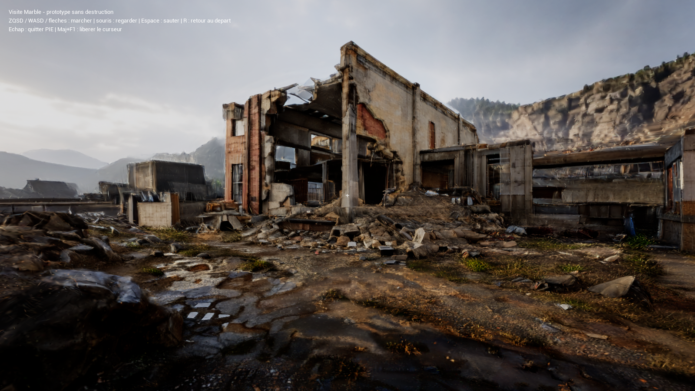
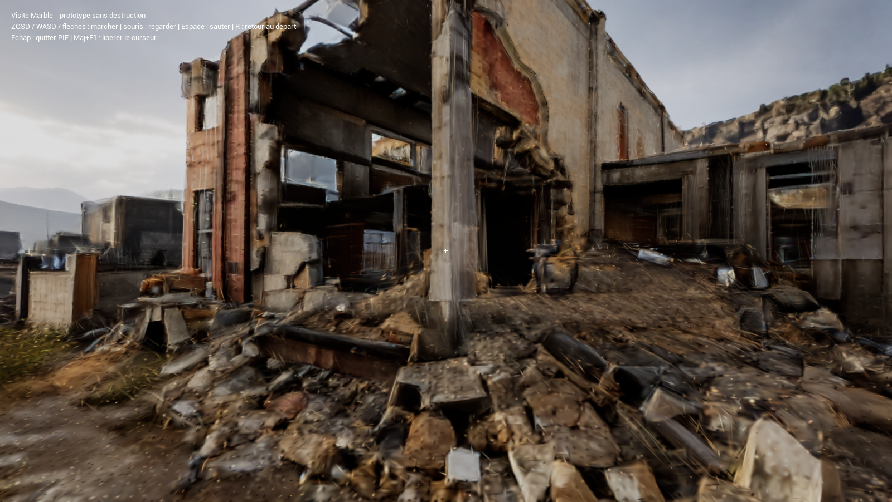

<div align="center">

# Destructible FPS

**Un FPS en développement sous Unreal Engine, avec un monde industriel à explorer et une destruction persistante à construire.**

Une usine en ruine, des matériaux qui devront réagir aux impacts, un état du monde partagé entre les joueurs.
Le développement se concentre aujourd'hui sur la visite en première personne et la qualité de l'environnement.

[Vidéo](#vidéo) · [Captures Unreal](#captures-unreal) · [État du projet](#état-du-projet) · [Essayer le projet](#essayer-le-projet) · [Suite](#prochaines-étapes)


[](#droits-et-attributions)



*Vue native de l'éditeur Unreal, 8 septembre 2026. Environnement 3D généré avec World Labs / Marble, rendu avec Cesium for Unreal.*

</div>

## État du projet

**Unreal Engine 5.8.2 est la direction de production depuis le 7 septembre 2026.**
Le prototype Rust reste une référence pour la simulation et le réseau. Les images ci-dessus
et ci-dessous montrent les avancées Unreal du 8 septembre, désormais présentées dans ce dépôt.

Le dernier jalon, **Marble Walk**, permet de parcourir une scène industrielle en première
personne dans l'éditeur Linux. Le rendu utilise un ensemble de points volumétriques
(*Gaussian splats*) issu du monde Marble ; un maillage de collision séparé permet la marche.

| Domaine | Ce qui fonctionne dans Unreal | Ce qui reste à valider ou développer |
|---|---|---|
| **Environnement industriel** | Scène importée, sauvegardée, relue et rendue nativement avec Cesium | Détail proche, stabilité visuelle en mouvement et budget GPU |
| **Visite en première personne** | Personnage et caméra, entrées clavier/souris, saut/réception, retour au départ ; parcours testé de 6,36 m | Couverture complète du terrain, maintien clavier prolongé et récupération automatique après chute |
| **Collision** | Maillage source distinct, contacts au sol et positions du parcours recoupés | Maillage ouvert ; tous les obstacles et limites de la carte ne sont pas qualifiés |
| **Destruction et construction** | Objectifs et références techniques du prototype Rust conservés | Combat, dégâts par matériau, effondrement et modification cohérente du décor Unreal |
| **Multijoueur et distribution** | Exigences d'autorité serveur et de persistance conservées | Réplication Unreal, package jouable, autres machines et autres systèmes |

Le jalon actuel est une **visite technique locale**, avec un rendu encore imparfait de près.
Les fonctionnalités de destruction du prototype Rust ne sont pas présentées comme déjà portées dans Unreal.
Le [point d'avancement et les preuves de capture](docs/checkpoints/2026-09-10-unreal-presentation.md)
précisent les essais réalisés et les limites de cette publication.

## Vidéo

[](docs/videos/2026-09-10-marble-walk.mp4)

[**Voir la visite — 32 s · 720p · MP4**](docs/videos/2026-09-10-marble-walk.mp4)

Enregistrée le **10 septembre 2026** dans le GameViewport Unreal sous Linux, cette vidéo
silencieuse montre un panoramique, une marche d'environ **6,3 m**, un saut avec réception
et le retour au départ. L'aperçu animé ci-dessus reprend quatre secondes de cette même session.

Le détail proche reste imparfait : il s'agit d'une visite de prototype, sans destruction ni
multijoueur. Les [preuves de cette session](docs/checkpoints/2026-09-10-unreal-video.md)
précisent le parcours, la capture et les limites de validation.

## Captures Unreal

Ces images proviennent des sessions natives du **8 septembre 2026**. Les deux vues suivantes
ont été prises dans le **GameViewport en Play In Editor**, avec le personnage et son HUD.
Les PNG sont publiées à l'identique ; aucune retouche ou génération d'image n'a été ajoutée.

### Dans la visite en première personne



*Vue au départ après le test du retour avec R. Le HUD appartient au prototype Unreal.*

### Au pied du bâtiment



*La vue rapprochée montre aussi le travail restant sur les surfaces et les gravats.*

Les environnements 3D ont été générés avec **World Labs / Marble**, puis intégrés et capturés
dans Unreal. Le [manifeste des images](docs/screenshots/2026-09-08-unreal-marble-manifest.json)
conserve leur origine, leur résolution et leur empreinte SHA-256.

## Essayer le projet

### Visite Unreal sur le poste de développement

La carte locale s'appelle `MarbleWalk_v1`. Sur le poste où le moteur, les plugins et les
assets ont déjà été préparés, la commande existante ouvre directement ce playtest :

```bash
python3 tools/unreal.py editor --playtest marble-walk --x11
```

Cliquer **Jouer**, puis dans la vue du jeu pour lui donner le focus.

| Commande configurée | Action |
|---|---|
| `ZQSD` / `WASD` / flèches | Marcher |
| Souris | Regarder |
| `Espace` | Sauter |
| `R` | Revenir au départ |
| `Échap` / `Maj+F1` | Arrêter PIE / libérer le curseur |

Les essais ont exercé W, Espace, R et la souris ; chaque variante de clavier n'a pas été testée.

**Cette publication apporte la présentation et les captures du travail Unreal local.**
Le code de migration est encore en cours de consolidation et n'est pas inclus dans cette version
publique. Un clone GitHub ne contient donc pas encore le lanceur et les assets nécessaires à
cette visite. Aucun exécutable Unreal prêt à télécharger n'est annoncé.

### Prototype Rust conservé

La base Rust publiée reste consultable et exécutable sous Linux/Vulkan : démo FPS grossière,
multijoueur local et inspecteur de géométrie fine. Ses commandes et anciennes captures se trouvent
dans le [guide du prototype Rust](docs/rust-prototype.md).

Les [contrats de simulation](docs/architecture.md) et la documentation technique liée dans ce
guide décrivent cette base historique. Ils servent de références pour les travaux futurs,
sans établir une équivalence fonctionnelle avec Unreal.

## Prochaines étapes

1. **Fiabiliser la visite** : vérifier un trajet plus long, les obstacles, les chutes et les contrôles.
2. **Mesurer la scène** : temps CPU/GPU, mémoire et stabilité du rendu au cours du déplacement.
3. **Construire une petite zone destructible** : matériaux distincts, collision et décor mis à jour ensemble.
4. **Relier simulation et multijoueur Unreal** : autorité serveur, persistance et convergence des clients.
5. **Préparer une distribution testable** : package, installation et validation sur une machine propre.

## Droits et attributions

Le code publié reste **UNLICENSED** : aucune licence open source globale n'est accordée.
Les attributions des assets historiques restent précisées dans le [guide Rust](docs/rust-prototype.md#droits-et-attributions).

Les captures Unreal créditent World Labs / Marble pour la génération du monde et Cesium for Unreal
pour son rendu dans le moteur Epic. La publication de ces vues ne redistribue ni le moteur Epic,
ni les plugins installés, ni les fichiers source du monde généré.
La [note de provenance](docs/checkpoints/2026-09-10-unreal-presentation.md#publication-et-attributions)
documente les conditions vérifiées pour ces captures.
