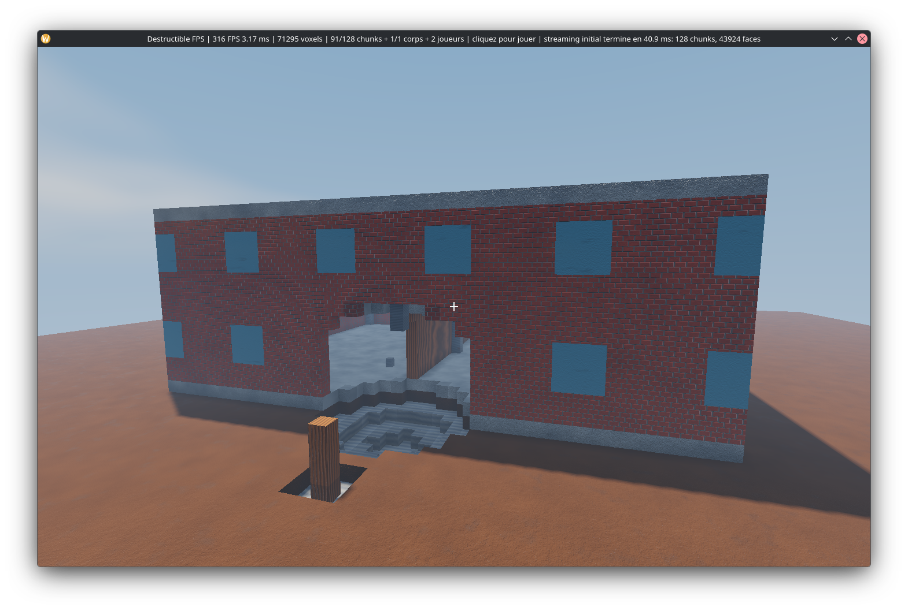
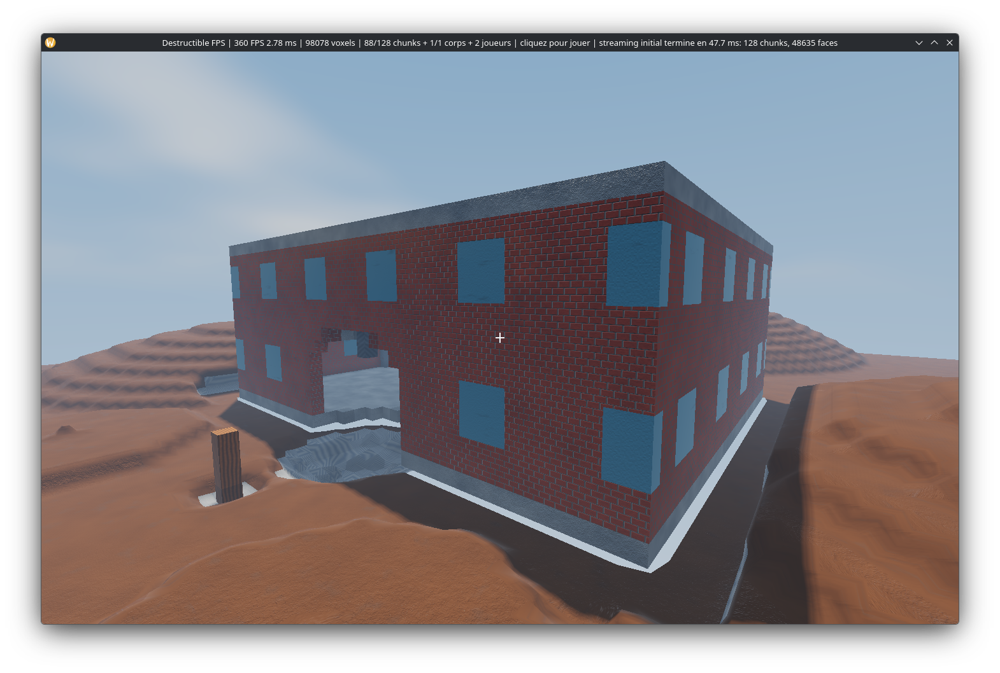
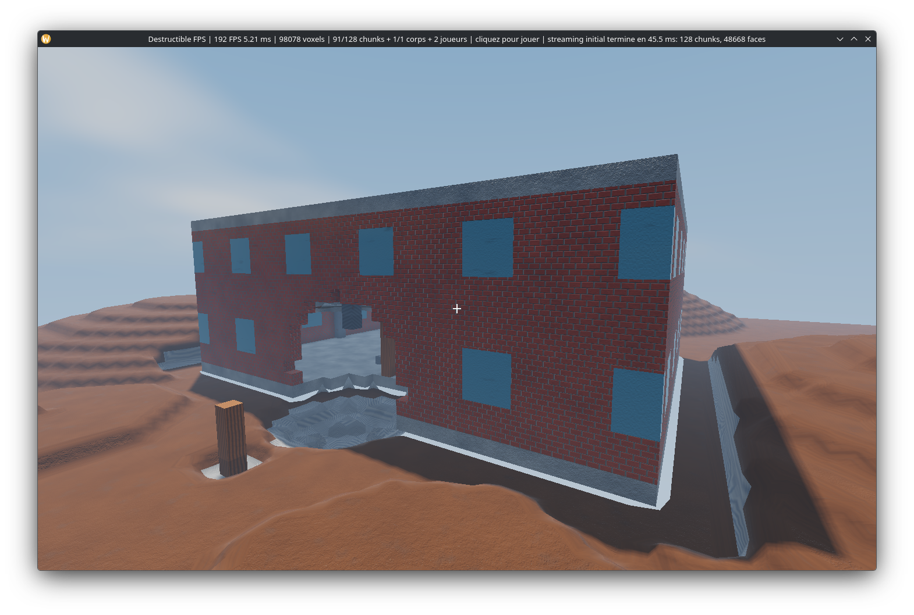
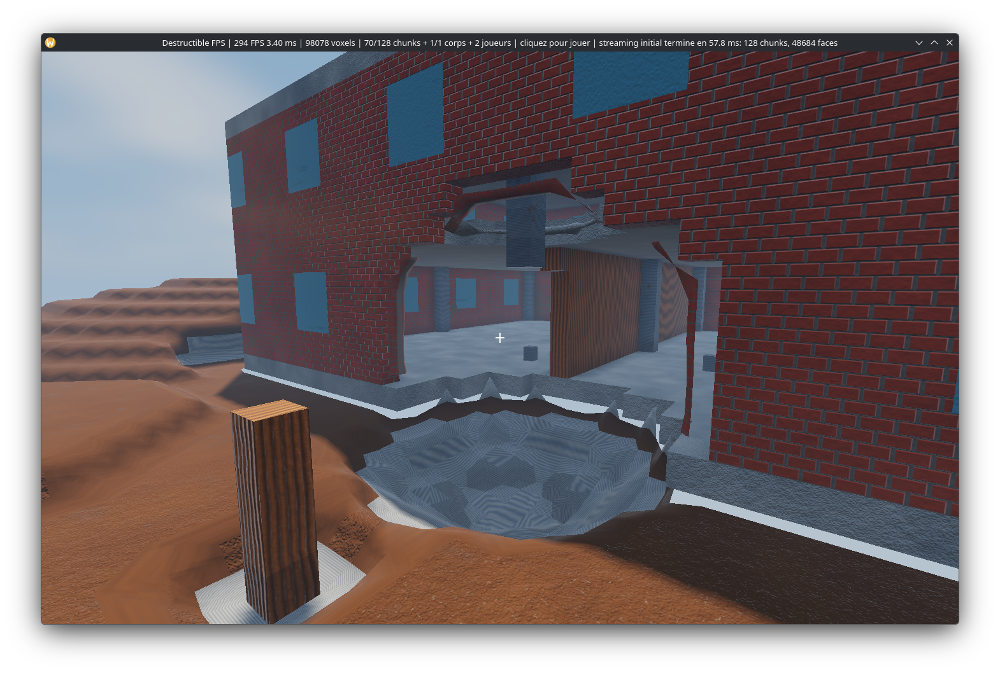

# Destructible FPS prototype

Technical spike for a photorealistic, server-authoritative multiplayer FPS whose terrain and
structures can ultimately be destroyed. This repository starts with the correctness and
performance foundations instead of presenting a scripted visual demo as if it were a game engine.

## First playable demo

The Linux demo now combines the authoritative core with a real-time first-person client:

- compact 16³ voxel chunks (2 bytes per voxel);
- material-dependent damage using deterministic integer arithmetic;
- atomic world transactions with a rolling 128-bit state fingerprint;
- replay protection and strict server sequencing;
- delta fragmentation below a 1,200-byte network MTU;
- out-of-order frame reassembly;
- a real nonblocking UDP dedicated-server process, fixed versioned control handshake, and
  two-client process-level loopback synchronization test;
- a transport-independent bounded authority core keyed by opaque peer IDs, with authenticated
  principal binding, stale-session cleanup, configurable application payload ceilings, and a thin
  legacy UDP adapter;
- bounded recent-delta retention and prioritized exact retransmission: a process test deliberately
  drops a complete sequence, buffers later deltas, requests repair, and proves convergence;
- canonical four-MiB-bounded world/body snapshots, paced transfer, selective 64-bit fragment repair
  windows, atomic install acknowledgement, and retained-delta catch-up before live delivery;
- a bounded deterministic UDP impairment proxy with finite declarative trace replay, exercising
  latency, jitter, loss, duplication, reordering, delta repair, fragment repair, acknowledgement
  retry, and equal server delta egress across four simultaneous real clients;
- a TLS 1.3 QUIC authority adapter with certificate verification, game-specific ALPN, bounded
  post-TLS credential admission, connection-bound principals, cryptographic server nonces,
  monotonic session IDs, and 1,100-byte encrypted gameplay datagrams;
- a bounded offline Keycloak-compatible OIDC verifier with RS256/JWKS key policy, exact
  issuer/audience and time validation, atomic key rotation, one-use `jti` replay defense, and stable
  issuer/subject-derived principals;
- a bounded OIDC discovery and refresh lifecycle using TLS-verified HTTPS only, no ambient proxy or
  redirect, exact issuer metadata, same-origin JWKS policy, fixed connection/request deadlines,
  optional bounded private roots, chunk-accounted JSON response ceilings, mandatory refresh before
  readiness, asynchronous rotation, and monotonic stale-key shutdown;
- a standalone secure authority process with bounded JSON/PEM/JWKS loading, strict Unix key-file
  permissions, complete-chain X.509 lifetime preflight, bounded certificate/key hot reload for future
  handshakes without disconnecting active players, monotonic TLS/JWKS safety shutdown, graceful
  interruption, and no credential-valued arguments;
- a reusable secure client bootstrap with bounded PEM/token files, strict Unix token permissions,
  cryptographic client nonces, verified TLS/ALPN, post-TLS credential admission, encrypted bounded
  datagrams, a fixed-capacity asynchronous receive queue with visible overflow accounting, and no
  credential-valued arguments;
- strict caps on incomplete packets, fragments, and retained bytes to prevent
  reassembly-memory exhaustion;
- atomic structural separation: detached voxels leave the static world and become bounded,
  server-owned body descriptors in the same transaction;
- protocol-v6 body assignments, three-axis translation, canonical fixed-quaternion orientation, and
  bounded angular velocity using compact server-monotonic 64-bit entity IDs, independent 128-bit
  geometry fingerprints, pre/post body fingerprints, and full client-side connectivity, material,
  mass, identity, and state revalidation;
- control-protocol-v3 construction requests with replay protection, fixed per-session resources,
  material costs, bounded coordinates, face-support and occupancy checks, conservative dynamic-body
  exclusion, six-metre authoritative-player reach, integer line-of-sight traversal, and ordinary
  fingerprinted world deltas shared by local, UDP, and authenticated QUIC clients;
- server-side network explosion envelopes limiting radius, radius-scaled energy and eye-to-target
  range before either loopback or authenticated QUIC authority may mutate the world;
- fixed-micrometre server player movement which retains only the newest sequenced unit-vector input,
  simulates once per 60 Hz tick, expires stale intent, and handles gravity, jumping, bounded terminal
  velocity, swept static-voxel contact, fall recovery, and 16 distinct recyclable spawn slots
  independently of client packet rate;
- player-state protocol v2, broadcasting a canonical sorted full view at 20 Hz in at most 910 bytes
  even at the 16-player cap, acknowledging each player's latest input, preserving exact fixed-step
  integration remainders, and a latest-wins client inbox that rejects malformed, stale, replayed,
  duplicate, or unordered state atomically;
- an eight-view remote-player interpolation buffer with a 100 ms target delay, exact integer
  interpolation, coherent join/leave boundaries, bounded history eviction, and safe edge clamping;
- local player prediction with contiguous input sequencing, a 128-input ceiling, atomic authority
  reconciliation, deterministic replay of every input newer than the server acknowledgement, and
  bounded visual correction smoothing with immediate snapping for large discontinuities;
- a fixed-capacity instanced remote-player GPU path: one shared avatar mesh, at most one world draw
  and one shadow draw for all remote players, with the local session excluded;
- a two-window multiplayer demo connecting either to the real 60 Hz loopback development server or
  the authenticated QUIC authority, with
  camera-relative input, prediction/reconciliation, interpolated remote avatars, reconnect attempts,
  replicated authoritative destruction/construction, rigid debris, automatic smoke trajectories,
  exact retained-delta repair, client-side bounded RTT/RTO estimation with Karn-filtered adaptive
  retransmission, transport-queue loss telemetry, and real two- and four-client process regressions;
- immediate detection of packet gaps and replica divergence;
- a repeatable end-to-end benchmark using a multi-material test building;
- a safe Vulkan renderer on `wgpu`, selecting the high-performance adapter;
- exact face-culled architectural meshes plus crack-free Surface Nets for soil and stone, using a
  fixed 17³-cell cache per chunk, distance-prioritized asynchronous initial streaming, and bounded
  background remeshing across every affected face, edge, or corner; sufficiently damaged brick and
  concrete reuse that bounded derived path for irregular static breach silhouettes while intact
  architecture remains exact; exposed one-voxel masonry cuts near the same authoritative damage
  inherit that derived silhouette across chunk boundaries and carry a deterministic local depth;
- bounded off-thread body meshing in local space, with fixed-capacity GPU instance transforms,
  independent body frustum culling, and participation in both world and shadow passes;
- 60 Hz server-authoritative body motion in deterministic micrometre units, mass-weighted blast
  impulses, inertia-weighted off-centre angular response, canonical fixed-quaternion integration,
  three-axis swept static collision using rotation-aware per-voxel conservative proxies, off-centre
  static-contact torque, material ground friction and normal restitution, vertical voxel-column body
  collision, rotation-aware vertical dynamic support through bounded per-voxel proxy refinement,
  four-pass swept X/Z body contacts, mass-weighted impulse exchange, off-centre dynamic-contact
  torque and tangential friction, stable stacking, wake propagation, sleeping, bounded
  sweep-and-prune broad phase, atomic overload rollback, and replicated GPU transforms about the
  mass centre;
- a 120 Hz fixed-step first-person controller with gravity, jumping, collision, and mouse look;
- server-authorized rifle and explosive impacts rendered from the replicated world;
- five attributed CC0 scanned PBR materials at real-world scale, two bounded offline-cooked texture
  arrays with full mip chains, explicit-gradient triplanar projection and body-local normal mapping;
- per-vertex voxel ambient occlusion, a 2,048² directional shadow map with 3×3 PCF filtering,
  energy-aware Cook-Torrance GGX, procedural steel/glass and an integrity-derived
  fracture/aggregate/crack response for masonry, and
  render-only facade, mineral-core, aggregate-chip and sparse reinforcement responses through
  exposed breach thickness,
  screen-footprint detail fading, a view-correct atmospheric sky, altitude haze, single-transfer
  tone mapping, and a crosshair;
- non-blocking real-GPU timestamp queries and bounded CPU/GPU p50/p95/p99 frame telemetry;
- conservative per-chunk camera-frustum culling with visible and submitted draw counters.

This is a **first playable engineering slice**, not yet a photorealistic or production multiplayer
game. The first realistic-material, atmosphere, and smooth hybrid-terrain foundations are live, but
the static masonry silhouette and layered cut shader are still a coarse procedural foundation.
Mixed exact/derived junctions now share pinned lattice corners to remove visible cracks and detached
edge ribbons; signed-direction ray tests cover the reported breach defect.
Smooth detached fracture bodies, true sub-voxel interiors and reinforcement geometry, calibrated
authored geometry, material blending, vegetation, reflections, temporal anti-aliasing and post-processing
remain visual gates. Exact convex contact manifolds,
gyroscopic response, deeper constraint-island convergence, fully integrated progressive structural failure,
remote-authority exposure, automated certificate issuance, first-person arms/weapon presentation,
transport pacing and congestion control, audio, and large-world residency streaming also remain
explicit later gates. See [`docs/visual-direction.md`](docs/visual-direction.md) for the visual target
and promotion order.

A separate [structural elasticity foundation](docs/structural-elasticity.md) now solves compression,
shear-aware bending and torsion, and measures load redistribution after losing supports. Its bounded
six-DOF solver is validated against analytical cases and a 64×32 wall. A bounded worker extracts
complete domains; the opt-in [coarse failure adapter](docs/structural-failure.md) assesses explicit
strengths, prepares mass-preserving fragments and commits ordinary replicated static-to-body
transactions. The [shared tick runtime](docs/structural-runtime.md) drives a playable lab, including
automatic remeshing, retained network repair and authenticated QUIC replication. Try
`cargo run --release --bin playable-demo -- --structural-lab` and press F at the beam root for a
partial test charge. Calibrated material response, crushing geometry, large-map recovery and
nonlinear/contact coupling remain required before realistic progressive collapse is playable.
Run `cargo run --release --bin structural-failure-benchmark -- --iterations 20` for the two-stage
support-failure fixture, or `structural-load-benchmark` for the separate numerical cases.

The first server-side structural pipeline is now integrated. A deterministic bounded topology
analyzer finds components adjacent to voxel edits, follows foundation or authored anchors, and emits
canonical detached-island proofs. The server revalidates each proof, derives integer-millimetre mass
properties, removes its voxels from the static world, and replicates the new body atomically. The
body is rendered from its preserved material voxels and receives a deterministic material-weighted
blast impulse. It sweeps all translation axes against static voxels, applies bounded restitution and
ground friction, stacks on exact vertical body columns or conservative rotated voxel proxies, and
sleeps after a deterministic rest interval. Four bounded passes separate coarse swept X/Z body
bounds, exchange normal velocity from mass and restitution, reduce tangential slip without losing
linear momentum, and propagate a short contact chain. A nearest-voxel blast application point
additionally generates deterministic angular velocity through the diagonal inertia tensor;
protocol-v6 deltas and snapshot-v2 transfers replicate the canonical quaternion, and the GPU rotates
the mesh around its mass centre. Rotated static sweeps use a deterministic conservative AABB for each
material voxel and derive their contact lever from the actual overlapped cell. Angular motion against
static geometry is sampled from a radius-derived travel bound; it stops before overlap or before
exceeding its fixed substep/cell budgets. Swept body contacts involving rotation refine the coarse
bounds through at most 4,096 canonical pairs of
conservative per-voxel proxies at rational impact time and discard empty proxy intersections.
Vertical support orders inclined bodies by their physical occupied bottom, corrects downward
penetration to the proxy boundary, damps residual angular motion, and propagates wake-up through the
same contact graph. Pair-budget exhaustion retains conservative separation or support but cannot
manufacture contact torque. Exact convex manifolds, full vertical impulse exchange and full
constraint-island convergence are not claimed yet.

## Screenshots










## Run

Development tools, isolated GPU captures and authoring checks are documented in
[`docs/tooling.md`](docs/tooling.md). Installing them does not add dependencies to the shipped game.

```bash
cargo test --all-targets
cargo test --test network
cargo test --test secure_transport
cargo test --test secure_authority
cargo test --test secure_server_process
cargo test oidc::tests
# Actual GPU validation (not covered by the ordinary headless matrix):
cargo test --test material_projection -- --ignored --nocapture
cargo run --release --bin destruction-benchmark -- --events 500
cargo run --release --bin structural-benchmark -- --iterations 100
cargo run --release --bin physics-benchmark -- --bodies 1024 --ticks 300
cargo run --release --bin physics-benchmark -- --bodies 1024 --ticks 300 --scenario rotated-stacks
cargo run --release --bin physics-benchmark -- --bodies 1024 --ticks 300 --scenario lateral-sweep
cargo run --release --bin physics-benchmark -- --bodies 1024 --ticks 300 --scenario rotated-lateral-sweep
cargo run --release --bin physics-benchmark -- --bodies 1024 --ticks 300 --scenario angular-sweep
cargo run --release --bin physics-benchmark -- --bodies 1024 --ticks 1000 --scenario dynamic-head-on
cargo run --release --bin physics-benchmark -- --bodies 1024 --ticks 300 --scenario rotated-dynamic-head-on
cargo run --release --bin snapshot-benchmark -- --iterations 20
cargo run --release --bin playable-demo
```

For the first real graphical multiplayer demo, start the loopback development server and
then one or more clients in separate terminals:

```bash
cargo run --release --bin dedicated-server -- --bind 127.0.0.1:40000
cargo run --release --bin multiplayer-demo -- --server 127.0.0.1:40000
```

The graphical recovery path can be exercised by adding
`--smoke-seconds 10 --smoke-drop-first-delta` to one client while another runs the ordinary smoke.
That client drops the whole first mutation until it observes the second, then must repair and present
both in order before the process can succeed. The final smoke line must also report
`rtt_samples=1`, a bounded `rto_ms`, and `drops_transport=0`.

Once a local secure authority has been provisioned as described below, the same graphical client can
use authenticated QUIC/TLS. The credential stays in its owner-only file and is never passed through
the process arguments:

```bash
cargo run --release --bin multiplayer-demo -- \
  --secure-server 127.0.0.1:40001 \
  --server-name game.local \
  --ca-cert /absolute/path/to/ca.pem \
  --credential-file /absolute/path/to/access-token-player-1
```

For a disposable loopback-only validation authority, the example target creates a new private
directory containing a ten-minute certificate/JWKS fixture and two distinct player credentials. The
directory path is the only argument; generated secrets are never printed and must be deleted after
the run:

```bash
cargo run --example secure_local_fixture -- /tmp/destructible-fps-secure-demo
```

This first networked graphical slice synchronizes character movement, remote players, authoritative
destruction, construction, and moving rigid debris. Once the cursor is captured, left click fires a
rifle blast, right click an explosive blast, and middle click builds wood. Start every client before
or after modifying the world: each admission installs an atomic snapshot, selectively requests lost
fragments, acknowledges installation, and resumes with ordered catch-up deltas. Recovery UI, remote
secure-server exposure, large-world residency streaming, and asset-quality presentation remain later
gates. Live changed chunks and detached body geometry are meshed through the same single-worker
bounded scheduler as the local demo. The unauthenticated UDP mode remains strictly loopback-only.
The graphical QUIC client accepts a remote address, but the current secure authority deliberately
rejects non-loopback exposure until its production security gates are met.

The legacy dedicated-server process is intentionally restricted to loopback. Its socket has been
separated from the reusable authority core and its real two-client path is exercised by
`cargo test --test network`; do not expose that binary to a LAN or the Internet. The separate secure
runtime now connects QUIC admissions and encrypted datagrams to the same authority core, and
`cargo test --test secure_authority` proves a two-client destructive transaction. The
`secure-dedicated-server` process loads certificate paths and a time-bounded OIDC JWKS from a
fail-closed file configuration. It still rejects non-loopback binds pending trusted online key
provisioning, automated certificate issuance, platform ACL checks, and the remote-exposure test gate.
Startup parses every certificate in the bounded chain, requires its current validity and more than
60 seconds remaining, then reserves the final 60 seconds by mapping the earliest expiry to an
earlier monotonic safety shutdown deadline. With reload enabled, the certificate must additionally
survive one complete watcher interval before that deadline. On Unix the
standalone process refuses effective UID 0, requires the private key to belong to its service UID,
accepts other trust files only from root or that UID, and opens every trust file with kernel
`O_NOFOLLOW` protection before validating the opened descriptor. Every immediate parent directory
must also be a non-link owned by root or the service UID and not group/world writable. An optional
bounded file watcher atomically validates replacement certificate/key pairs and changes only future
QUIC handshakes; existing sessions are not disrupted. It distinguishes an unchanged valid check from
a newly installed public certificate chain without hashing or logging private-key material. The secure
boundary tests
cover TLS certificate rejection, application-credential rejection, admission timeout, nonce
mismatch, datagram bounds, invalid credentials, and per-session rate limiting. A separate offline
OIDC verifier validates pre-provisioned JWKS. Fifteen external-process tests additionally prove valid
OIDC command admission, mandatory trusted discovery before readiness, atomic replacement of a wrong
bootstrap key, issuer-mismatch refusal, invalid-token rejection without simulation work, remote-bind
refusal, expired-certificate refusal, Unix private-key permission refusal, and live certificate-file
rotation without dropping an established session, observable unchanged-certificate checks, and
autonomous fail-closed shutdown after either a real TLS renewal outage or a short static OIDC trust
window reaches its pre-expiry safety deadline, bounded 32-plus-one admission saturation, and closure
of an oversized authenticated datagram before simulation work. Multi-session queue saturation and
32 complete authenticated reconnect cycles are also exercised without an applied command.
Automated certificate issuance, reliable control/snapshot streams, and remote deployment policy are
still required. The current executable
coverage and every remaining promotion proof are explicit in
[`docs/remote-exposure-gate.md`](docs/remote-exposure-gate.md).

The future LAN path also has a bounded offline policy contract and checker. It records one exact
private address, interface, UDP port, certificate name, OIDC issuer, canonical firewall source
ranges, engine limits, observability budget, rollback owner, and an expiry no more than 24 hours
away. Validation deliberately grants no network capability: `secure-dedicated-server` still accepts
only loopback. Copy `config/lan-deployment-policy.example.json` outside the repository, replace every
placeholder, set a fresh expiry, then lint the proposed document with:

```bash
cargo run --release --bin lan-policy-check -- /absolute/path/to/lan-policy.json
cargo run --release --bin lan-policy-check -- --verify-host /absolute/path/to/lan-policy.json
cargo run --release --bin lan-policy-check -- \
  --certificate-chain /absolute/path/to/server-chain.pem \
  --trust-anchor /absolute/path/to/reviewed-root.pem \
  /absolute/path/to/lan-policy.json
cargo run --release --bin lan-policy-check -- \
  --certificate-chain /absolute/path/to/server-chain.pem \
  --trust-anchor /absolute/path/to/reviewed-root.pem \
  --private-key /absolute/path/to/server-key.pem \
  /absolute/path/to/lan-policy.json
```

The optional host check enumerates interfaces without opening a socket and requires one unique,
operational interface/address/index/prefix match. The optional certificate proof accepts one exact,
ordered chain and one explicitly reviewed self-issued CA, requires a single literal DNS SAN and
server-auth usage, and verifies the signatures at the current time and at policy expiry plus the
reserved 60-second margin. Adding `--private-key` proves that one protected canonical PEM key matches
the attested leaf and supports a TLS 1.3 signature scheme; the checker never prints or fingerprints
private material. On Unix this identity mode must run as the non-root key owner and rejects any
group/other permission bit. The checks can be combined in one invocation. Firewall state, issuer,
certificate issuance/revocation policy and Windows DACLs must still be checked independently before
this contract can participate in a private-network launch.

For local protocol development the legacy authority can be started directly:

```bash
cargo run --release --bin dedicated-server -- --bind 127.0.0.1:40000
```

The authenticated authority accepts only one non-secret argument: an absolute configuration path.
See [`docs/secure-server.md`](docs/secure-server.md) and
[`config/secure-server.example.json`](config/secure-server.example.json):

```bash
cargo run --release --bin secure-dedicated-server -- \
  --config /absolute/path/to/secure-server.json
```

The benchmark includes server-side destruction, encoding, deliberate frame reordering, decoding,
reassembly, client application, and final server/client verification. It is not a renderer-only
microbenchmark.

### Controls

- click the window to capture the pointer;
- `ZQSD` or `WASD` to move, `Shift` to sprint, and `Space` to jump;
- left click for a localized rifle impact;
- right click for a larger explosive blast;
- middle click to place a full-integrity wood voxel on the targeted supported face;
- `Escape` releases the pointer; press it again to quit.

For a non-interactive graphics check that exits automatically:

```bash
cargo run --release --bin playable-demo -- --smoke-seconds 5
```

For a reproducible orbit around an already damaged authoritative world (useful for screenshots):

```bash
cargo run --release --bin playable-demo -- --showcase
```

For the deterministic close view used to inspect breach thickness and material layers:

```bash
cargo run --release --bin playable-demo -- --showcase-closeup
```

The window title reports FPS, frame time, solid voxel count, cursor state, and the most recent
authoritative destruction result. An auto-terminating smoke run prints bounded redraw cadence,
CPU frame-work, GPU shadow, GPU world/HUD, and GPU-total distributions. Point-in-time measurements
are recorded in [`docs/performance.md`](docs/performance.md).

## Runtime dependencies

All versions are pinned in `Cargo.toml`. `wgpu` provides a safe Vulkan abstraction, `winit` owns
Linux window/input integration, `glam` supplies SIMD-friendly camera math, `bytemuck` performs
checked POD uploads, and `pollster` bridges one-time GPU initialization. `quinn`, `rustls`, `ring`,
`tokio`, and `bytes` provide the portable asynchronous QUIC/TLS foundation; `zeroize` protects the
application-owned temporary credential buffers from compiler-elided clearing. `rcgen` exists only in
tests to create ephemeral loopback identities. `jsonwebtoken`, AWS-LC, `serde`, and `serde_json`
provide maintained RS256/JWK and bounded claims parsing while repository code owns the strict OIDC
policy, replay cache, and principal mapping. These dependencies are permissively licensed upstream
and replace fragile platform-specific boilerplate; game rules, destruction, replication, admission
policy, meshing, controller, and shaders remain repository-owned.

`miniz_oxide` (MIT OR Zlib OR Apache-2.0, portable Rust with its small `adler2` dependency) decodes
the fixed 53.33 MiB embedded PBR payload under a hard output limit, only once at renderer startup.
It avoids shipping a runtime JPEG decoder or making asset network requests. The initial pack is
34.64 MiB, with approximately 194 ms measured release decode time on this workstation; this is a
startup cost, not frame-loop work. The public CC0 source pins, cooker versions, physical scales,
offline reproduction commands and remaining compression work are documented in
[`assets/materials/README.md`](assets/materials/README.md).

## Engineering targets

- 60 Hz authoritative simulation for nearby gameplay;
- 120 Hz local input and weapon prediction;
- 1,200-byte application frames to avoid IP fragmentation;
- GPU-driven Vulkan renderer with explicit frame budgets;
- no full chunk transfer during ordinary destruction;
- periodic snapshots only for joining or repairing a detected gap;
- scalable interest management rather than broadcasting the whole world.

The runtime architecture is documented in [`docs/architecture.md`](docs/architecture.md). The
complete path from this engineering slice to a distributable game, including measurable promotion
gates and performance budgets, lives in [`docs/production-roadmap.md`](docs/production-roadmap.md).
The expanded active-goal acceptance contract is [`docs/game-contract.md`](docs/game-contract.md):
it includes cumulative wood damage, explosive masonry breaches, failure of overloaded remaining
foundations, actual runtime photorealism, sustained performance and cross-platform multiplayer.
