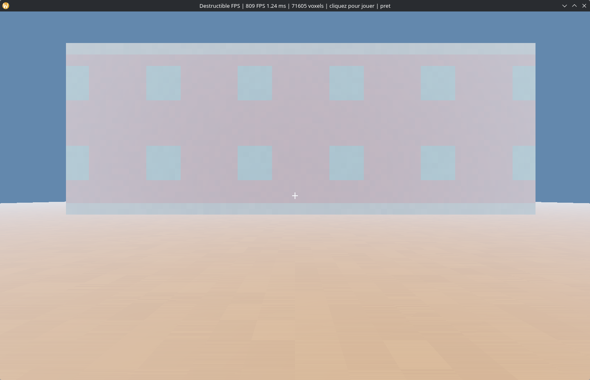
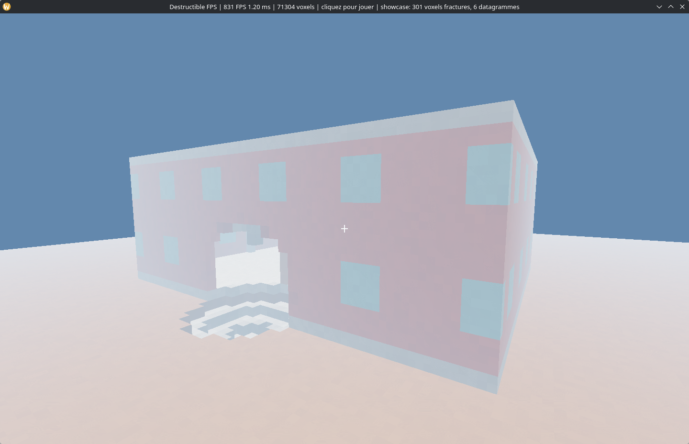
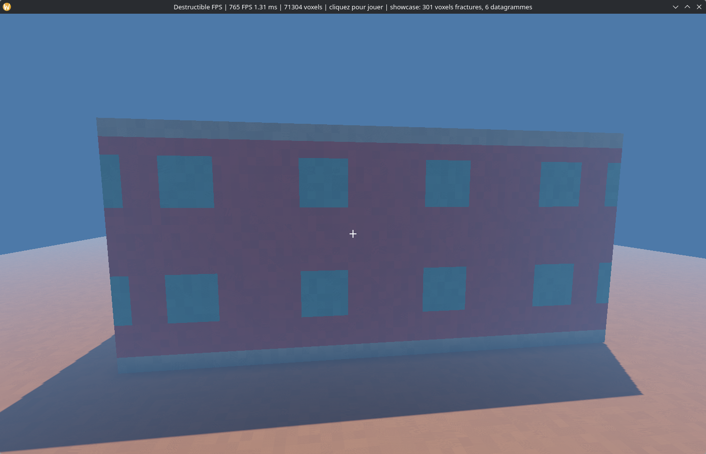

# Destructible FPS prototype

Technical spike for a photorealistic, server-authoritative multiplayer FPS whose terrain and
structures can ultimately be destroyed. This repository starts with the correctness and
performance foundations instead of presenting a scripted visual demo as if it were a game engine.

## First playable demo

The Linux demo now combines the authoritative core with a real-time first-person client:

- compact 16³ voxel chunks (2 bytes per voxel);
- material-dependent damage using deterministic integer arithmetic;
- atomic world transactions with a rolling 128-bit state fingerprint;
- replay protection and strict server sequencing;
- delta fragmentation below a 1,200-byte network MTU;
- out-of-order frame reassembly;
- real UDP loopback transport coverage for fragmented deltas;
- strict caps on incomplete packets, fragments, and retained bytes to prevent
  reassembly-memory exhaustion;
- atomic structural separation: detached voxels leave the static world and become bounded,
  server-owned body descriptors in the same transaction;
- protocol-v4 body assignments and fixed-state updates using compact server-monotonic 64-bit entity
  IDs, independent 128-bit geometry fingerprints, pre/post body fingerprints, and full client-side
  connectivity, material, mass, identity, and state revalidation;
- immediate detection of packet gaps and replica divergence;
- a repeatable end-to-end benchmark using a multi-material test building;
- a safe Vulkan renderer on `wgpu`, selecting the high-performance adapter;
- face-culled chunk meshes, distance-prioritized asynchronous initial streaming, and bounded
  background remeshing limited to chunks whose visible boundary changed;
- bounded off-thread body meshing in local space, with fixed-capacity GPU instance transforms,
  independent body frustum culling, and participation in both world and shadow passes;
- 60 Hz server-authoritative body gravity in deterministic micrometre units, swept static and
  voxel-column body collision, stable vertical stacking, wake propagation, sleeping, bounded
  sweep-and-prune broad phase, atomic overload rollback, and replicated GPU transforms;
- a 120 Hz fixed-step first-person controller with gravity, jumping, collision, and mouse look;
- server-authorized rifle and explosive impacts rendered from the replicated world;
- per-vertex voxel ambient occlusion, a 2,048² directional shadow map, procedural material
  shading, distance fog, single-transfer tone mapping, and a crosshair;
- non-blocking real-GPU timestamp queries and bounded CPU/GPU p50/p95/p99 frame telemetry;
- conservative per-chunk camera-frustum culling with visible and submitted draw counters.

This is a **first playable engineering slice**, not a photorealistic or production multiplayer
game. Horizontal and angular rigid-body response, progressive structural stress, remote sessions,
audio, asset-quality PBR, temporal anti-aliasing, and large-world residency streaming remain
explicit later gates.

The first server-side structural pipeline is now integrated. A deterministic bounded topology
analyzer finds components adjacent to voxel edits, follows foundation or authored anchors, and emits
canonical detached-island proofs. The server revalidates each proof, derives integer-millimetre mass
properties, removes its voxels from the static world, and replicates the new body atomically. The
body is rendered from its preserved material voxels, falls under the 60 Hz authority, stacks on
exact voxel-column surfaces, and sleeps after a deterministic rest interval. This first solver is
axis-aligned and resolves downward contacts; rotation, friction, restitution, and general impulses
are not claimed yet.

## Screenshots







## Run

```bash
cargo test --all-targets
cargo run --release --bin destruction-benchmark -- --events 500
cargo run --release --bin structural-benchmark -- --iterations 100
cargo run --release --bin physics-benchmark -- --bodies 1024 --ticks 300
cargo run --release --bin playable-demo
```

The benchmark includes server-side destruction, encoding, deliberate frame reordering, decoding,
reassembly, client application, and final server/client verification. It is not a renderer-only
microbenchmark.

### Controls

- click the window to capture the pointer;
- `ZQSD` or `WASD` to move, `Shift` to sprint, and `Space` to jump;
- left click for a localized rifle impact;
- right click for a larger explosive blast;
- `Escape` releases the pointer; press it again to quit.

For a non-interactive graphics check that exits automatically:

```bash
cargo run --release --bin playable-demo -- --smoke-seconds 5
```

For a reproducible orbit around an already damaged authoritative world (useful for screenshots):

```bash
cargo run --release --bin playable-demo -- --showcase
```

The window title reports FPS, frame time, solid voxel count, cursor state, and the most recent
authoritative destruction result. An auto-terminating smoke run prints bounded redraw cadence,
CPU frame-work, GPU shadow, GPU world/HUD, and GPU-total distributions. Point-in-time measurements
are recorded in [`docs/performance.md`](docs/performance.md).

## Runtime dependencies

All versions are pinned in `Cargo.toml`. `wgpu` provides a safe Vulkan abstraction, `winit` owns
Linux window/input integration, `glam` supplies SIMD-friendly camera math, `bytemuck` performs
checked POD uploads, and `pollster` bridges one-time GPU initialization. They are permissively
licensed upstream and replace fragile platform-specific boilerplate; game rules, destruction,
replication, meshing, controller, and shaders remain repository-owned.

## Engineering targets

- 60 Hz authoritative simulation for nearby gameplay;
- 120 Hz local input and weapon prediction;
- 1,200-byte application frames to avoid IP fragmentation;
- GPU-driven Vulkan renderer with explicit frame budgets;
- no full chunk transfer during ordinary destruction;
- periodic snapshots only for joining or repairing a detected gap;
- scalable interest management rather than broadcasting the whole world.

The runtime architecture is documented in [`docs/architecture.md`](docs/architecture.md). The
complete path from this engineering slice to a distributable game, including measurable promotion
gates and performance budgets, lives in [`docs/production-roadmap.md`](docs/production-roadmap.md).
