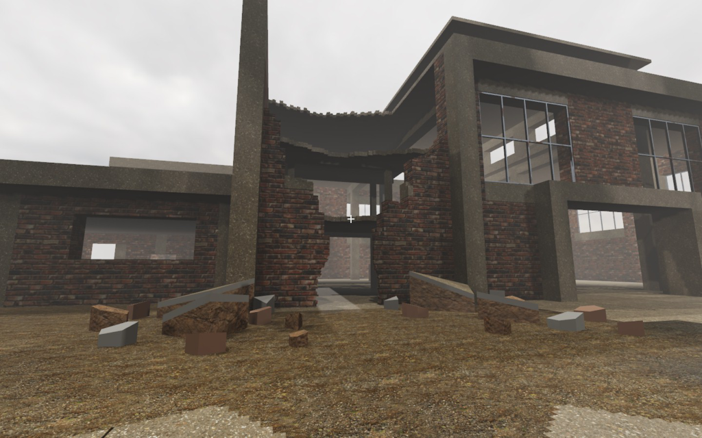
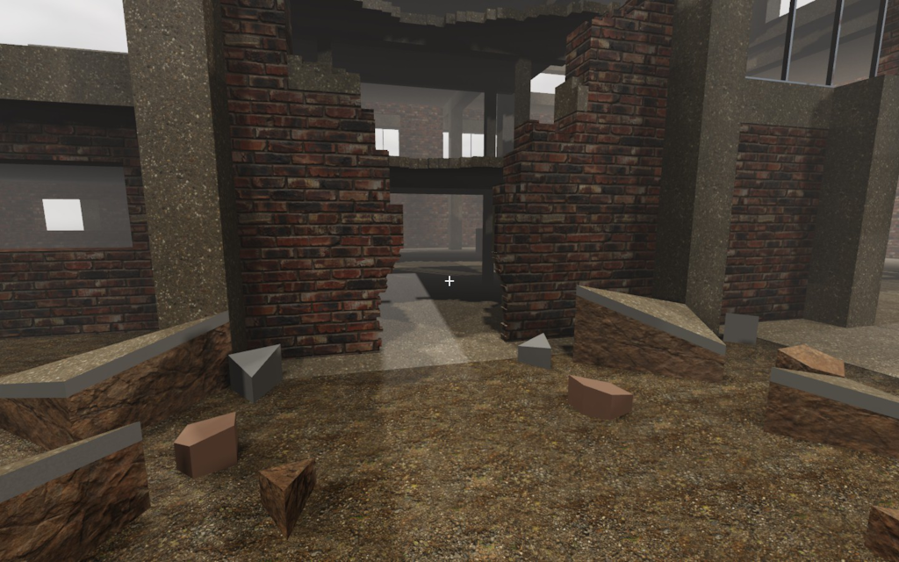
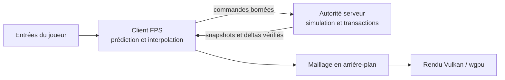

<div align="center">

# Destructible FPS

**Un prototype Rust pour construire, détruire et partager le même monde.**

Explorer un site industriel, ouvrir une brèche et observer des débris dont le serveur
contrôle l'état : les premières briques d'un FPS à destruction persistante.

[Démarrer](#démarrer) · [État du prototype](#en-bref) · [Architecture](docs/architecture.md) · [Feuille de route](docs/production-roadmap.md)


[](#droits-et-attributions)



*Inspecteur natif au checkpoint du 6 septembre 2026. Cette scène fine est distincte de la démo FPS jouable.*

</div>

## En bref

Le projet vise un FPS photoréaliste et multijoueur avec une destruction qui modifie réellement
le monde. **La version publiée est un prototype technique : le photoréalisme reste à atteindre.**
Les trois chemins ci-dessous permettent d'examiner séparément le jeu, le réseau et la géométrie.

| Chemin | Ce que vous pouvez essayer | État actuel |
|---|---|---|
| **Démo FPS locale** | Se déplacer, tirer, recharger, provoquer une explosion, construire du bois et déplacer des débris par les impacts | Monde principalement à cellules d'un mètre, scène industrielle jouable |
| **Démo multijoueur locale** | Ouvrir plusieurs clients, voir les autres joueurs et partager les modifications du monde | Autorité serveur, prédiction, snapshots et réparation ; serveurs limités au loopback |
| **Inspecteur géométrique** | Parcourir quatre états préparés, examiner les parois fines et les fragments obliques, sonder les matériaux | Géométrie d'inspection ; combat fin, effondrement convexe et réplication de ces fragments encore à intégrer |

La plateforme éprouvée est **Linux x86_64 avec Vulkan**, en session Wayland ou X11.
Windows, macOS et la distribution sur des machines propres restent des objectifs.
Le [guide de reprise](REPRISE.md) et le [checkpoint documenté](docs/checkpoints/2026-09-06.md)
précisent les preuves et les limites de cet état publié.

## Pourquoi ce prototype

- **La destruction change l'état du monde.** Les dégâts dépendent du matériau ; un morceau
  détaché quitte la géométrie statique et devient un corps contrôlé par le serveur.
- **Les joueurs partagent les mêmes mutations.** Les transactions sont séquencées et portent
  des empreintes avant/après. Une perte de paquets ou une divergence déclenche une réparation bornée.
- **Le rendu suit la simulation.** Maillage et reconstruction se font en arrière-plan ; terrain,
  architecture et corps mobiles disposent de chemins adaptés à leur géométrie.
- **Les progrès se mesurent.** Tests de processus réseau, benchmarks et mesures CPU/GPU sont
  documentés séparément de la qualité artistique. Une capture ou une moyenne de FPS ne suffit pas.

## Démarrer

### Préparer le poste

Il faut **Rust/Cargo 1.97 ou supérieur**, un environnement de compilation Linux et une session
graphique avec un pilote Vulkan fonctionnel. Les dépendances directes sont épinglées dans
[Cargo.toml](Cargo.toml) et [Cargo.lock](Cargo.lock) ; le dépôt ne fixe pas un toolchain Rust exact.
Les packs de matériaux et d'environnement sont versionnés : aucun téléchargement de textures
n'est nécessaire au lancement ordinaire. Les outils de capture et de préparation d'assets sont
facultatifs, décrits dans [docs/tooling.md](docs/tooling.md).

```bash
git clone https://github.com/AdrienAvalon/destructible-fps.git
cd destructible-fps
cargo build --locked --release --bin playable-demo --bin fine-geometry-demo
```

### Jouer dans la scène industrielle

```bash
./target/release/playable-demo --world industrial
```

Cliquer dans la fenêtre pour capturer la souris, puis :

| Commande | Action |
|---|---|
| `ZQSD` ou `WASD` · souris | Se déplacer et regarder |
| `Maj` · `Espace` | Courir et sauter |
| Clic gauche · `R` | Tirer et recharger les munitions disponibles |
| Clic droit | Déclencher une explosion expérimentale |
| Clic molette | Construire un voxel de bois sur une face supportée |
| `Échap` | Libérer la souris, puis quitter au second appui |

`--world range` retrouve la scène de référence initiale. `--msaa 1` sélectionne un profil
moins coûteux que le MSAA 4× par défaut ; voir le [contrat d'affichage HDR](docs/hdr-display.md).
Les tirs sont des intentions résolues par le serveur, avec portée, cadence, munitions et dégâts
bornés : [contrat du fusil et limites](docs/ballistics.md).

### Examiner la géométrie fine

Fermer la démo FPS avant de comparer cette autre scène :

```bash
./target/release/fine-geometry-demo --world industrial --view approach
```

`↑` / `↓` tournent la vue, `W` / `S` règlent le zoom, `←` / `→` changent d'état,
`P` sonde le matériau et `Échap` quitte. Les vues nommées sont `approach`, `wide` et `fracture`.
Le [contrat d'inspection convexe](docs/convex-inspection.md) explique ce qui est représenté
et ce qui reste à raccorder à la simulation jouable.

<div align="center">


*Vue de fracture préparée dans l'inspecteur ; les fragments visibles ne proviennent pas d'un effondrement dynamique fin.*
</div>

### Essayer plusieurs clients sur le même poste

Démarrer le serveur de développement dans un terminal :

```bash
cargo run --locked --release --bin dedicated-server -- --bind 127.0.0.1:40000 --world industrial
```

Puis ouvrir un ou plusieurs clients dans des terminaux séparés :

```bash
cargo run --locked --release --bin multiplayer-demo -- --server 127.0.0.1:40000
```

La carte est choisie **sur le serveur** et reçue par snapshot. Les clients synchronisent les joueurs,
la destruction, la construction et les corps mobiles, y compris après une arrivée en cours de partie.
Tous doivent être reconstruits ensemble pour partager les mêmes versions de protocole.

Le serveur UDP de développement est sans authentification et reste strictement limité à
`127.0.0.1`. Un second chemin **QUIC/TLS 1.3 avec admission OIDC** existe, également limité
au loopback côté serveur. Ce dépôt ne livre pas encore de serveur LAN ou Internet prêt à déployer.

La procédure de [serveur sécurisé](docs/secure-server.md) couvre la configuration, les certificats
et les fichiers d'identifiants ; le [contrat d'exposition distante](docs/remote-exposure-gate.md)
liste les preuves encore requises. L'outil de [politique LAN](docs/lan-deployment-policy.md)
valide un document hors ligne et n'autorise aucune ouverture réseau.

<details>
<summary>Connexion graphique à une autorité QUIC locale déjà configurée</summary>

Le serveur ne reçoit que le chemin absolu de sa configuration. Le client lit son identifiant dans
un fichier aux droits restreints ; ne pas transmettre de jeton dans les arguments de processus.

```bash
cargo run --locked --release --bin secure-dedicated-server -- \
  --config /absolute/path/to/secure-server.json

cargo run --locked --release --bin multiplayer-demo -- \
  --secure-server 127.0.0.1:40001 \
  --server-name game.local \
  --ca-cert /absolute/path/to/ca.pem \
  --credential-file /absolute/path/to/access-token-player-1
```

L'exemple `secure_local_fixture` crée un jeu d'identités jetables de dix minutes dans un nouveau
dossier privé, pour la seule validation loopback :

```bash
cargo run --locked --example secure_local_fixture -- /tmp/destructible-fps-secure-demo
```

Suivre [la procédure complète](docs/secure-server.md) et supprimer ces secrets après l'essai.

</details>

## Architecture

Le noyau déterministe possède le monde, les dégâts et les transactions. Le serveur y ajoute
les sessions, les limites de commandes, les mouvements et la réplication. Les clients appliquent
les états acceptés, prédisent leurs entrées et reconstruisent la géométrie à afficher.



| Composant | Fondations publiées | Documentation |
|---|---|---|
| **Monde et destruction** | Chunks de voxels, réponse par matériau, mutations atomiques, empreintes d'état | [Architecture](docs/architecture.md), [volumes fins](docs/refined-volumes.md) |
| **Structure et corps** | Séparation, masse, mouvement déterministe, contacts conservatifs et laboratoire de rupture | [Masse](docs/mass-properties.md), [runtime structurel](docs/structural-runtime.md) |
| **Réseau** | Séquençage, paquets bornés, snapshots, retransmission, tests réels de pertes et réordonnancement | [Architecture](docs/architecture.md), [serveur sécurisé](docs/secure-server.md) |
| **Rendu** | Architecture exacte, terrain Surface Nets, scans PBR, ombres, HDR et MSAA | [Monde industriel](docs/industrial-world.md), [affichage HDR](docs/hdr-display.md) |
| **Géométrie d'inspection** | Parois fines et solides convexes partageant maillage et requêtes exactes | [Inspection convexe](docs/convex-inspection.md), [rendu fin](docs/fine-rendering.md) |

Les corps et contacts restent soumis à des approximations et à des budgets fixes. Les manifolds
convexes complets, l'effondrement fin généralisé et la convergence complète des îlots de contraintes
ne sont pas acquis. Le [plan de production](docs/production-roadmap.md) conserve les étapes
et critères de passage vers un jeu distribuable.

## Vérifier et mesurer

Le script versionné réunit la matrice CPU, les tests, les benchmarks et les contrôles des outils :

```bash
bash tools/validate_checkpoint.sh
```

Pour les contrôles graphiques, avec une session disponible et un vrai GPU Vulkan :

```bash
bash tools/validate_checkpoint.sh --gpu
```

Le mode CPU ne valide pas le GPU ; les tests graphiques ignorés ne comptent pas comme réussis.
Les résultats datés, le matériel, les images natives et leur provenance sont conservés dans le
[checkpoint](docs/checkpoints/2026-09-06.md). Les mesures CPU/GPU et leurs limites sont dans
[docs/performance.md](docs/performance.md), sans promesse de FPS indépendante de la machine.

<details>
<summary>Commandes ciblées pour le développement</summary>

```bash
cargo fmt --check
cargo clippy --locked --all-targets -- -D warnings
cargo test --locked --all-targets
cargo test --locked --release --all-targets
cargo test --locked --test network
cargo test --locked --test secure_transport
cargo test --locked --test secure_authority
cargo test --locked --test secure_server_process
cargo test --locked oidc::tests
cargo run --locked --release --bin destruction-benchmark -- --events 500
cargo run --locked --release --bin structural-benchmark -- --iterations 100
cargo run --locked --release --bin physics-benchmark -- --bodies 1024 --ticks 300
cargo run --locked --release --bin snapshot-benchmark -- --iterations 20
```

Contrôles graphiques explicites :

```bash
cargo test --locked --test material_projection -- --ignored --nocapture
cargo run --locked --release --bin playable-demo -- --smoke-seconds 5
cargo run --locked --release --bin playable-demo -- --showcase
cargo run --locked --release --bin playable-demo -- --showcase-closeup
```

Les scénarios de physique supplémentaires, les traces de réseau dégradé et les smokes de réparation
sont décrits dans [l'architecture](docs/architecture.md) et [les performances](docs/performance.md).

</details>

## Documentation et suite du projet

- [REPRISE.md](REPRISE.md) — état publié, commandes et prochain jalon.
- [Contrat du jeu](docs/game-contract.md) et [feuille de route](docs/production-roadmap.md) — ambitions et critères de validation.
- [Checkpoint et galerie](docs/checkpoints/2026-09-06.md) — captures natives, résultats datés et provenance.
- [Direction visuelle](docs/visual-direction.md) — cible artistique générée, distincte du rendu atteint.
- [Outils](docs/tooling.md) — capture, profilage et préparation d'assets.
- [Cartes](docs/map-generation.md), [scénarios](docs/gameplay-authoring.md) et [outils d'agents](docs/agent-tooling.md) — contrats des extensions prévues.
- [Références techniques](docs/references.md) — sources et choix de conception.

Une anomalie reproductible ou une discussion de conception peut être signalée dans les
[issues](https://github.com/AdrienAvalon/destructible-fps/issues). Pour travailler sur le code,
lire [AGENTS.md](AGENTS.md) : déterminisme, limites mémoire/réseau et séparation des preuves
visuelles, fonctionnelles et de performances font partie du contrat du projet.

## Droits et attributions

Le code est déclaré **`UNLICENSED`** et **`publish = false`** dans [Cargo.toml](Cargo.toml) :
la publication des sources n'accorde pas de licence open source.

Les dépendances conservent leurs licences respectives. Les matériaux scannés et l'environnement HDR
proviennent de Poly Haven sous CC0 ; auteurs, sources, empreintes et recettes sont conservés dans
[assets/materials](assets/materials/README.md) et [assets/environment](assets/environment/README.md).
Ces droits sur les assets ne changent pas ceux du code du jeu.
