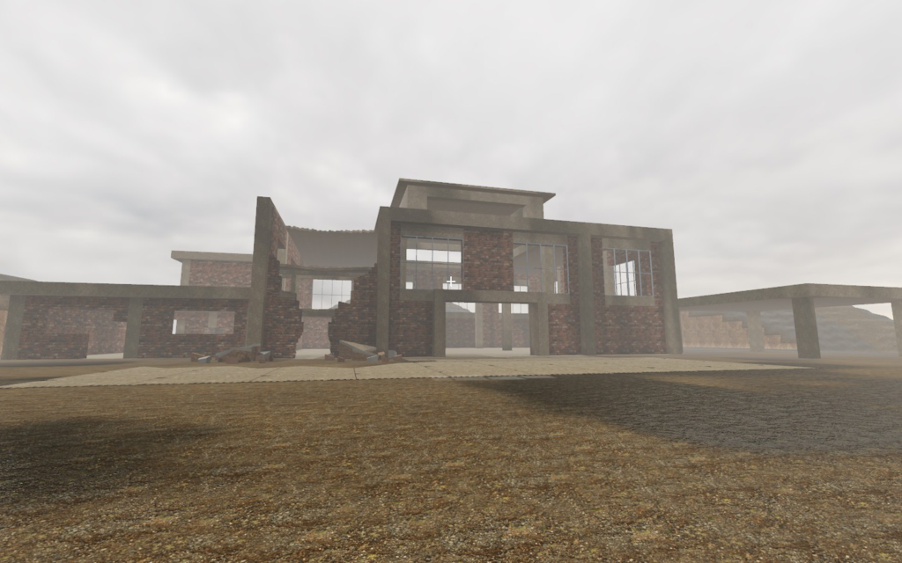

# Checkpoint technique — 6 septembre 2026

Point de départ sauvegardé à la demande de l'utilisateur, **pas une acceptation photoréaliste**.
La priorité suivante est le rendu natif et une petite scène industrielle cohérente ; voir
[REPRISE.md](../../REPRISE.md) pour les exigences, outils, étapes et commandes.

## Identité et portée

Base du lot moteur : `cedb136` (`feat(map): add supported ruined-factory scene and stable cut finishes`).
Le commit moteur `575aa25` ajoute la géométrie convexe d'inspection ; le commit documentaire qui
contient ce reçu conserve les images et la procédure. Utiliser `git log --oneline` pour leurs
identifiants, sans fabriquer une empreinte de commit auto-référente.

- FPS jouable : scène industrielle coarse avec tirs/explosions/construction et corps autoritaires.
- Dernière scène graphique : inspecteur natif, états préparés, géométrie fine et 24 fragments fixes.
- Aucun combat fin, effondrement convexe dynamique ou multijoueur convexe n'est livré par ce lot.
- Linux x86_64/Vulkan testé ; pas de paquet Windows/macOS ni de jeu réseau exposé.
- Publication source autorisée : GitHub public et GitLab privé. La politique `UNLICENSED` /
  `publish = false` reste inchangée. Pas de tag/release binaire créé par ce checkpoint.

## Galerie persistante

### Cible artistique — image générée, pas le moteur


Prompt/provenance dans [visual-direction.md](../visual-direction.md). Le PNG original est déjà
versionné ; on le conserve, sans le régénérer ni le faire passer pour une capture du jeu.

### Moteur actuel — approche


### Moteur actuel — fracture


### Moteur actuel — vue large



Ces trois PNG sont des copies **byte-identiques**, sans retouche générative, des thumbnails de
RenderDoc 1.45, Vulkan, frame 400. Ils ne proviennent ni de Blender ni d'un générateur d'images.
Les captures instrumentées ne servent pas de mesures de performances. Les images montrent encore
des pièces clairsemées, des supports trop congruents, des coupes trop plates et un terrain/bâtiment
trop simples. Les conserver évite de confondre progrès du noyau et qualité artistique acquise.

| Vue | Capture locale d'origine sous `target/tooling/` | Taille `.rdc` / draws / textures |
| --- | --- | --- |
| Approche | `renderdoc-vtfscgga` | 304955239 / 269 / 14 |
| Fracture | `renderdoc-3k2fwsm7` | 306526484 / 261 / 14 |
| Large | `renderdoc-udkd93qu` | 297524586 / 293 / 14 |

Les `.rdc` et vidéos restent ignorés : ce sont des centaines de Mo de données de travail, pas des
assets de distribution. Les images sélectionnées et leur provenance suffisent au point de reprise
versionné ; elles ne remplacent pas la possibilité de refaire les captures depuis les outils.

SHA-256 des images conservées :

```text
9319360a56e920269f958ae1321c168db2d87d6980f8503137fb1424263c8d01  docs/concepts/photoreal-industrial-target-v1.png
8c75e2bfa3e6a1e7916116178c83ba3d04f739492b1c61157d62d6659fe6c0e2  docs/screenshots/2026-09-06-convex-approach.png
85b2af12fe29ed9c4df4aac21ab002e3ffcc6e2ef825d365655d5a7b30446f67  docs/screenshots/2026-09-06-convex-fracture.png
1a8be694a1764945677925584f4649276da8d7ffa58f1e351ca2d96fa015d9d0  docs/screenshots/2026-09-06-convex-wide.png
```

## Ce qui a changé dans le moteur

Les détails et preuves sont dans [convex-inspection.md](../convex-inspection.md) :

1. Solides convexes fermés et quantifiés au 1/256 m : validation topologique/géométrique, bornes
   d'allocations et de travail, ordre canonique et limites de précision du rendu.
2. Maillage, rayons de matériau et contacts SAT partagent les mêmes sommets/plans. Sweeps limités
   à une boîte d'orientation fixe en translation ; pas de manifold ni CCD angulaire revendiqué.
3. Composition immuable du monde fin et des fragments ; refus des chevauchements et des sources
   périmées. Pas d'implémentation trompeuse de `StaticGeometry` ni de changement aux codecs réseau.
4. Liaison exacte des quatre états, réservation de la mémoire GPU et upload unique des fragments
   à la première publication complète, à l'intérieur des plafonds existants.
5. Remplacement effectif de l'ancien tablier en escalier dans cette scène, ancienne fixture gardée.
6. Échelle/contraste des coupes corrigés et tests GPU étendus, sans prétendre que du bruit de shader
   suffit à produire des fractures photoréalistes.

Le précédent lot avait corrigé un autre défaut : une classification de coupe comparée en flottant
après interpolation perspective. Le test raster reproduisait le problème ; un marqueur entier flat
le corrige. La [haze plein écran rejetée](../occluded-haze.md) n'a pas été réintroduite.

## Validation durable et distinction des preuves

Les anciens logs `/tmp/fps-convex-scene-6d4fQA/` ne sont plus disponibles lors de cette sauvegarde.
Le reçu historique [convex-inspection](../convex-inspection.md) conserve leurs résultats, sans
prétendre qu'un chemin temporaire est encore consultable. Une validation CPU indépendante a été
refaite pour ce checkpoint ; aucune fenêtre GPU utilisateur n'a été lancée par cette passe.

| Contrôle refait | Exit | Résultat |
| --- | ---: | --- |
| `cargo fmt --check` | 0 | Conforme |
| `cargo clippy --all-targets -- -D warnings` | 0 | Conforme |
| `cargo test --all-targets` | 0 | 607 réussis, 7 GPU ignorés |
| `cargo test --release --all-targets` | 0 | 607 réussis, 7 GPU ignorés |
| `cargo test --doc` | 0 | 3 compile-fail réussis |
| Réseau / transport / autorité / processus sécurisés / OIDC | 0 | 13 / 6 / 8 / 15 / 6, déjà inclus dans les 607 |
| Destruction 500 événements | 0 | Répliques synchronisées |
| Structure 100 itérations | 0 | Analyses terminées |
| Physique 1024 corps, 300 ticks | 0 | Simulation terminée |
| Snapshot 20 itérations | 0 | Aller-retours terminés |
| Reconstruction des trois exécutables standalone après tests | 0 | Empreintes ci-dessous |

Machine : i7-13700H, Linux 7.2.2-1-cachyos, Rust/Cargo 1.97.1. Logs de cette passe :
`/tmp/fps-checkpoint-validation-IVHrSx/`, remplaçables par une réexécution du script versionné
[validate_checkpoint.sh](../../tools/validate_checkpoint.sh). Le reçu ci-dessus ne dépend pas de
leur conservation. Les suites ciblées sont des reruns, pas des tests distincts supplémentaires.

Le script durable a ensuite été relu et réellement exécuté en mode CPU : **17/17 étapes exit 0**,
607 tests dans chaque profil, trois doctests, **23 tests Python**. `bash -n`, ShellCheck et les
contrôles d'arguments invalides passent. Logs locaux : `target/checkpoint-validation-4kZTkz/`.
Les empreintes de toutes les sources moteur/tests et des fichiers Cargo sont identiques avant/après.
Le script emploie `--locked`, reconstruit les exécutables après les harness release et annonce
explicitement que son mode CPU ne valide ni GPU ni qualité visuelle.

GPU : le reçu moteur rapporte les sept tests Vulkan explicitement exécutés dans chaque profil,
les smokes natifs et les mesures isolées **avant** cette passe documentaire. Les deux exécutables
d'inspection reconstruits ont les mêmes empreintes que ceux de ces mesures/captures. Les 7 GPU
ignorés de la nouvelle passe CPU ne constituent pas une nouvelle validation graphique.

```text
7a47c68856eb65f87456dfab2e3d2ca527ba24f5e4edee206da4b56da11f9c8c  target/release/playable-demo
a8ce87f8b9eee42e7609874cf1fc608cc9d3b522acf069d8123ca989cf010ff3  target/release/fine-geometry-demo
8ce09561e440d2e9fa69326445ca1426f24e63cd855bc20f3a263466c945ddc6  target/release/fine-mesh-benchmark
```

Ces empreintes identifient les binaires locaux, pas une build reproductible garantie sur tout OS
ni une signature d'auteur. Pour les timings CPU/GPU p50/p95/p99 par vue, la géométrie résidente,
le GPU et les réglages exacts, lire le reçu moteur. Une scène d'inspection statique à haute fréquence
ne prouve pas les performances d'un combat destructif soutenu ou d'un serveur chargé.

Le spot-check de mouvement est conservé localement dans `target/convex-scene-motion-5CO94L/` :
6 secondes, 90 images à 15 FPS, fenêtre native possédée de 1440×900, trajectoire orbit/zoom,
smoke de 20 secondes terminé. Son `process.log` et les dimensions ont été recoupés ; aucune
inspection image-par-image complète n'est revendiquée. Pas de vidéo ni de bureau personnel publié.

## Conservation, revue et publication

La revue Claude du lot moteur était bornée à des extraits sélectionnés, pas à tout le dépôt ; ses
constats confirmés et contestés sont dans le reçu moteur. Les avis ne remplacent pas les tests.
La sauvegarde ajoute un contrôle de cohérence documentaire et d'hygiène avant premier push public.
Ce n'est pas un audit de sécurité exhaustif ni une certification de tous les tiers.

L'appel Claude de revue de ce dossier de sauvegarde a échoué sans avis exploitable (helper exit 75) ;
il ne constitue donc pas une approbation. La lecture indépendante des sources/documents, les tests
rejoués et la vérification des images/empreintes restent les preuves disponibles. Pas de boucle de
relances ni de transcript privé conservé dans Git.

L'examen heuristique de l'historique préalable (110 commits, 1057 blobs dont 1044 textuels) n'a
identifié ni secret exploitable, ni fichier d'authentification, ni transcript. Le plus gros objet
est le pack PBR attendu de 36320919 octets. Les métadonnées des anciennes captures ne montrent pas
de donnée personnelle ; les certificats de provenance du concept généré sont conservés. Les
commits gardent leur identité auteur/committer d'origine ; l'historique n'est pas anonymisé ni réécrit.
Ce contrôle n'est pas une garantie d'absence de secret et ne couvre pas les fichiers ignorés.

Conserver l'historique complet, le code, les recettes, les manifests de provenance et les images
sélectionnées. Ne pas publier de secrets, fichiers d'authentification, mémoire privée, sorties SOPS,
transcripts Claude/Codex, caches ou profils machine. Ne pas recopier les helpers de l'infrastructure
dans le jeu. Le concept et les images réelles sont distingués dans tous les points d'entrée.

Le prochain bilan doit remplacer explicitement l'état courant et ajouter un nouveau reçu daté,
sans effacer les échecs visuels ou réécrire les résultats historiques de ce checkpoint.
