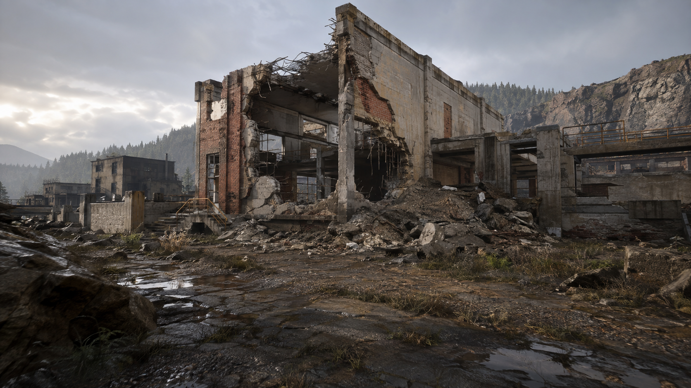

# Visual direction and photoreal promotion gates

The simulation remains voxel-authoritative, but the final image must not expose a Minecraft-like
rendering model. Voxels describe occupancy, material, integrity, networking and fracture. They are
not the long-term surface representation. Rendering may derive richer meshes and cosmetic detail as
long as it preserves the authoritative boundary and stays within fixed asynchronous work budgets.

## Target

This image is an AI-generated art-direction reference, not a runtime capture or a promise that the
current engine already reaches this fidelity. It establishes the intended grounded scale: a damaged
European industrial/quarry site, layered concrete/brick/steel failure, damp terrain, restrained
vegetation, natural atmosphere, readable traversal and no visible voxel grid.

Generation prompt (built-in image generation):

> Photorealistic first-person view of a fully destructible modern industrial training site in a
> rocky temperate landscape; believable concrete, brick, steel, glass, earth and rubble; a
> physically plausible facade breach revealing rebar and layered material; late-afternoon
> overcast sun, soft global illumination, contact shadows, restrained vegetation and smooth natural
> terrain. Environment only, no people, weapons, vehicles, UI, text, logos or watermark. Avoid
> Minecraft, cubes, blocky terrain, toy proportions, saturated stylization and cinematic blur.

## Delivered foundation

- stable material identity crosses CPU meshing into the GPU without changing voxel, physics or wire
  formats;
- brick bond/mortar, concrete aggregate/staining, stone strata, soil moisture/grit, wood grain,
  steel brushing/rust and glass grime are synthesized in material-local coordinates;
- detached bodies preserve their material projection while moving instead of sampling world-locked
  textures;
- screen-footprint fading reduces distant procedural shimmer;
- Cook-Torrance GGX consumes the synthesized albedo, roughness, metalness and finite-difference
  micro-normal;
- the sky reconstructs each view ray from the inverse view-projection matrix and shares its
  atmosphere with distance haze;
- a fixed 3×3 PCF kernel softens the existing bounded 2,048² directional shadow map.
- soil and stone now use crack-free Surface Nets while authored brick, concrete, wood, steel and
  glass preserve exact architectural edges;
- each natural chunk uses a fixed 17³-cell cache, adaptive quad diagonals, bit-identical seams in
  all six directions, and conservative face/edge/corner invalidation after edits;
- deterministic quarry banks make the smoother silhouette visible without changing the building,
  spawn, authoritative shot corridor, voxel fingerprints, physics, or network formats.

The generated concept is not shipped as a runtime texture. The initial runtime remains dependency
free and deterministic at the visual-input boundary.

## Promotion order

1. Hybrid surface extraction (terrain delivered): retain exact cubes for authored architecture,
   derive smooth crack-free soil and stone from the same voxel field, then extend the derived
   representation to irregular fracture silhouettes and detached bodies.
2. Layered destruction: distinguish facade, aggregate, reinforcement, insulation and interior
   surfaces; generate bounded local rubble and dust from authoritative fracture inputs.
3. Asset/material pipeline: versioned texture arrays, calibrated color/normal/roughness/metalness,
   mip generation, compression and aggressive LOD with deterministic fallbacks.
4. Lighting/post: cascaded sun shadows, image-based sky lighting, reflection probes, HDR exposure,
   temporal anti-aliasing, contact refinement and quality tiers.
5. World dressing: instanced vegetation, decals, drainage/puddles, terrain blending, props and sound
   without making gameplay targets unreadable.

Every promotion must preserve asynchronous remeshing, authoritative fingerprints and protocol
bytes. Record GPU/CPU p50/p95/p99 on the representative breach scene; a prettier frame that exceeds
the fixed simulation/render budget or shimmers in motion does not pass.

Chunk streaming currently prioritizes render uploads from a complete immutable world snapshot; it
does not treat an absent render mesh as absent neighbor world data. Future partial world residency
must retain a neighbor halo or explicitly invalidate both sides when that data arrives.

The current natural mesh is visual-only. Collision, ray impacts, and authority deliberately retain
the conservative voxel volume, so contacts can precede the smoothed surface near a rounded edge.
That temporary mismatch is preferable to weakening authority with an unvalidated floating-point
collision proxy; a derived deterministic collision representation remains a later promotion gate.
